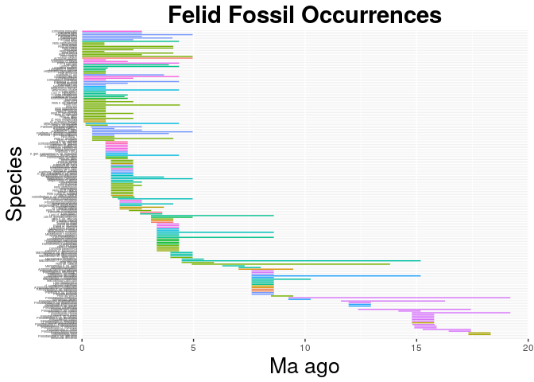
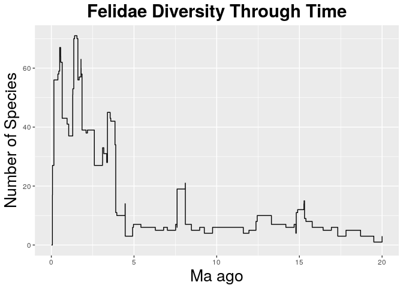

    library(ggplot2)
    felids <- read.csv("felidae_ranges.csv", header = F, as.is = T)
    names(felids) <- c("genus", "species", "minage", "maxage")
    head(felids)

    ##              genus                        species  minage  maxage
    ## 1         Panthera               Panthera cf. leo 0.06885 0.06885
    ## 2         Acinonyx                 Acinonyx aicha 3.09400 3.09400
    ## 3         Acinonyx               Acinonyx jubatus 0.00585 3.96050
    ## 4    Adelphailurus        Adelphailurus kansensis 7.60000 7.60000
    ## 5    Adelphailurus Adelphailurus n. sp. kansensis 7.60000 7.60000
    ## 6 Amphimachairodus  Amphimachairodus coloradensis 7.60000 7.60000

    library("forcats")
    felids$maxage <- felids$maxage+0.5
    felid_occ <- ggplot(felids, aes( x = fct_reorder(species, minage, .desc = T), maxage, colour = genus))
    felid_occ <- felid_occ + geom_linerange(aes(ymin = minage, ymax = maxage + 0.5))
    felid_occ <- felid_occ + theme(legend.position="none")
    felid_occ <- felid_occ + coord_flip()
    felid_occ <- felid_occ +  theme(axis.text.y = element_text(size=3))
    felid_occ <- felid_occ + theme(axis.ticks.y=element_blank())
    felid_occ <- felid_occ + scale_y_continuous(limits=c(0, 20), expand = c(0, 0), breaks=c(0, 5, 10, 15, 20))
    felid_occ <- felid_occ + labs(title = "Felid Fossil Occurrences", x = "Species", y = "Ma ago") + theme(plot.title = element_text(hjust = 0.5, size=22, face = "bold"), axis.title =element_text(size=20))

    felid_occ

    ## Warning: Removed 3 rows containing missing values (geom_linerange).

    ggsave(filename = "output_pdf/felid_occ.pdf", plot = felid_occ)

    ## Saving 7 x 5 in image

    ## Warning: Removed 3 rows containing missing values (geom_linerange).

Diversity
---------

    library(tidyr)
    library(dplyr)

    ## 
    ## Attaching package: 'dplyr'

    ## The following objects are masked from 'package:stats':
    ## 
    ##     filter, lag

    ## The following objects are masked from 'package:base':
    ## 
    ##     intersect, setdiff, setequal, union

    diversity <- felids %>% gather(key = type, value = age, minage, maxage) %>% mutate(count = ifelse(type == "maxage", 1, -1)) %>% group_by(age) %>% summarise(count = sum(count))  %>% arrange(-age, -count) %>% mutate(diversity = cumsum(count)) 

    felid_div <- ggplot(diversity, aes(x = age, y = diversity)) + geom_step()

    felid_div <- felid_div + labs(title = "Felidae Diversity Through Time", x = "Ma ago", y = "Number of Species") + theme(plot.title = element_text(hjust = 0.5, size=22, face = "bold"), axis.title =element_text(size=20))
    felid_div

    ggsave(filename = "output_pdf/felid_div.pdf", plot = felid_div)

    ## Saving 7 x 5 in image
