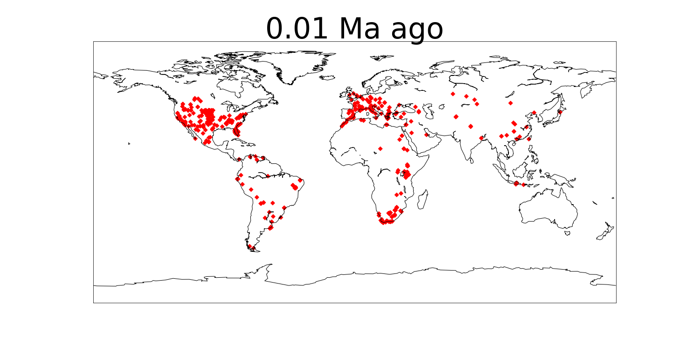
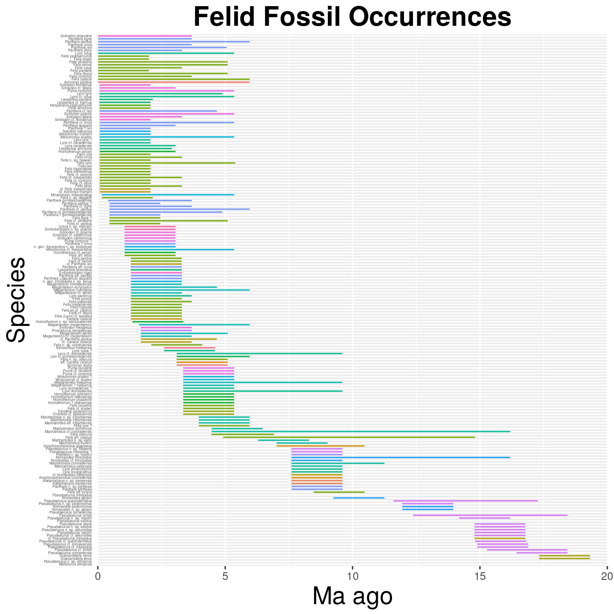
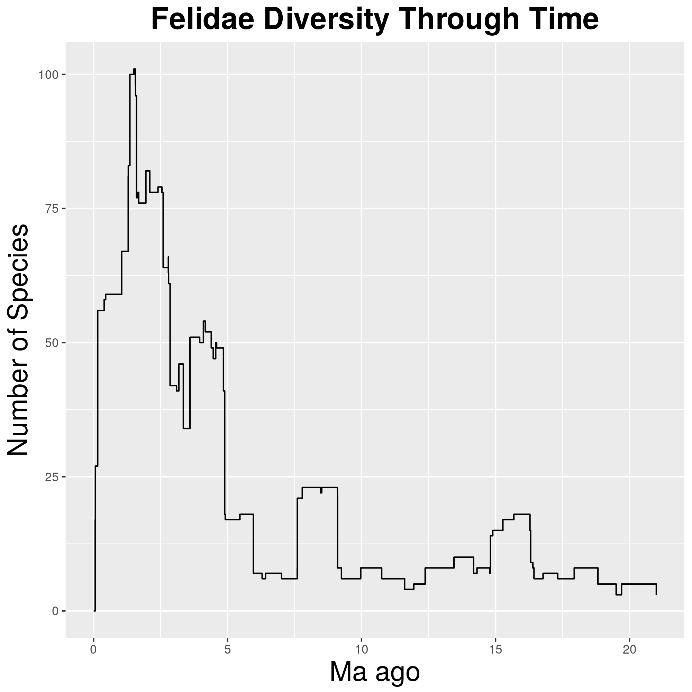

# Introduction

Felidae is a taxonomic family of cats. Members of Felidae range from the domestic cat to extant big cats, such as lions and tigers, but also extinct members such as the saber-toothed tiger. This project aims to analyze the diversity of Felidae through time and space. Throughout the history of Felidae, some interesting events include the divergenece between modern cats and now extinct saber-toothed cats, such as the smilidon, and the Late Miocene Radiation, which spiked another wave of speciation [@Christiansen2008;@Johnson73]. Various graphs of diversity will illustrate these events. Unfortunately, studies of other clades reveal a fall in species richness after large diversification events like the late Miocene and divergence of sabertooths [@Raia2016]. Felidae is indeed in decline, and many species, such as the tiger, are endangered today. 


\clearpage

# Methods

The data utilized in this project is found on the PaleoBiology Database online at paleodb.org. Occurrence data of fossils is downloadable as a CSV file with species name, and an estimate for the age of each fossil in the collection. In order to find species diversity through time, the files are cleaned up with UNIX, then run through python functions to get the data into a plottable format, and finally visualized using R. R is used to plot occurrences and species diversity through time. Since the fossil ages are estimates, we can use PyRate to statistically analyze more accurate estimates for speciation and extinction rates.  In addition to occurrence data, the paleobiology database also houses collection data with information on the locations of the fossils as well as their ages. This information can be used to plot the fossil through time, showing the geographic distribution of Felidae through history, creating a GIF with python.

## Mapping by Fossil Age(python)
```{python, eval = F}
min_ma = column_extractor("formatted_felidae_col.csv", 0, 11) 
#extract lower bound of fossil age

max_ma = column_extractor("formatted_felidae_col.csv", 0, 12) 
#extract upper bound of fossil age

#iterate through data, find average fossil age, 
#add it to a new dictionary with average fossil age for each fossil
avg_ma = {}
for key in min_ma.keys():
    avg = ( float(max_ma[key]) + float(min_ma[key]) ) / 2
    avg_ma[key] = avg
    
longitude = column_extractor("formatted_felidae_col.csv", 0, 3) 
#extract longitude column
latitude = column_extractor("formatted_felidae_col.csv", 0, 4) 
#extract latitude column

strat_lng = stratify(avg_ma, longitude) 
#stratify longitude by avg_ma
strat_lat = stratify(avg_ma, latitude) 
#stratify latitude by avg_ma

unique_avg_ma ={} 
#empty dictionary to hold values of avg_ma as keys
#for use as titles in map
#populate dictionary with for loop
for value in avg_ma.values():
    unique_avg_ma[value] = 1


strat_lng2 = [] 
#new dictionaries to add longitude for each avg_ma and lower avg_ma
strat_lat2 = [] 
#same as above but for latitude

#this for loop will add all previous 
#points to each current list of points
for i in range(0, len(strat_lng)):
    new_dict = {} #new dictionary for use in for loop
    index = i #variable to decrement for use in while loop
    while(index > 0): #loop will decrement index until 0
        for key in strat_lng[index].keys():
            new_dict[key] = strat_lng[index][key]
        index = index - 1 #decrement to previous index
    strat_lng2.append(new_dict)


#now we do the same for latitude
for i in range(0, len(strat_lat)):
    new_dict = {}
    index = i
    while(index > 0):
        for key in strat_lat[index].keys():
            new_dict[key] = strat_lat[index][key]
        index = index - 1
    strat_lat2.append(new_dict)
    
unique_avg_ma ={} #empty dictionary to hold values of avg_ma as keys
#populate dictionary with for loop
for value in avg_ma.values():
    unique_avg_ma[value] = 1
#create list of uniqe ages
unique_ages = list(sorted(unique_avg_ma.keys())) 
#reverse the order of list
unique_ages.reverse()

#this for loop will go through the fossils by avg_ma and 
#create a fossil map for each fossil age stratified over
#saved as png in folder maps
for i in range(0, len(strat_lng3)):    
    x = strat_lng3[i]
    y = strat_lat3[i]
    title = str(round(unique_ages[i], 2)) + " Ma ago"
    filename = "maps/map{}.png".format(i) #reverse order
    map_plotter(x, y, filename, title)
    ```

## Converting to GIF(python)
```{python, eval = F}

import imageio
    
filenames =[]
for i in range(0, 48):
    filenames.append("maps/map{}.png".format(i))
images = []

for filename in filenames:
    images.append(imageio.imread(filename))
imageio.mimsave('maps/movie.gif', images)
#file called movie.gif is created within the maps folder
```

## Output to R: Fossil Occurrences(python)
```{python, eval = F}
felid_ranges = extract_fossil_ages("formatted_felidae_occ.csv")

dict_to_file(felid_ranges, "felidae_ranges.csv")
```

## Reading in data(R)
```{r, eval=FALSE}
library(ggplot2)
#file created using pyton code (shown above)
felids <- read.csv("felidae_ranges.csv", header = F, as.is = T)
names(felids) <- c("genus", "species", "minage", "maxage")
head(felids)
```

## Plotting Occurrences(R)
```{r, eval=FALSE}
library("forcats")
felids <- felids %>% arrange(maxage)
felids$maxage <- felids$maxage+0.5
felid_occ <- ggplot(felids, 
                    aes( x = fct_reorder(species, 
                    minage, .desc = T), maxage, colour = genus))
felid_occ <- felid_occ + 
  geom_linerange(aes(ymin = minage, ymax = maxage + 0.5))
felid_occ <- felid_occ + 
  theme(legend.position="none")
felid_occ <- felid_occ + 
  coord_flip()
felid_occ <- felid_occ +  
  theme(axis.text.y = element_text(size=3))
felid_occ <- felid_occ + 
  theme(axis.ticks.y=element_blank())
felid_occ <- felid_occ + 
  scale_y_continuous(limits=c(0, 20), 
  expand = c(0, 0), breaks=c(0, 5, 10, 15, 20))
felid_occ <- felid_occ + 
  labs(title = "Felid Fossil Occurrences", x = "Species", y = "Ma ago") + 
  theme(plot.title = element_text(hjust = 0.5, 
  size=22, face = "bold"), axis.title =element_text(size=20))

felid_occ
```

## Plotting Diversity(R)
```{r, eval=FALSE}
library(tidyr)
library(dplyr)
#create new variable diversity which is the number of species 
diversity <- felids %>% gather(key = type, value = age, minage, maxage) 
  %>% mutate(count = ifelse(type == "maxage", 1, -1)) %>% group_by(age) 
  %>% summarise(count = sum(count))  %>% arrange(-age, -count) 
  %>% mutate(diversity = cumsum(count)) 

#plot diversity v age
felid_div <- ggplot(diversity, aes(x = age, y = diversity)) + geom_step()

#add labels and theme
felid_div <- felid_div + labs(title = "Felidae Diversity Through Time", 
  x = "Ma ago", y = "Number of Species") + 
  theme(plot.title = element_text(hjust = 0.5, size=22, face = "bold"), 
  axis.title =element_text(size=20))
felid_div

```

## PyRate R script(shell)
```{r, eval=FALSE}
#! /bin/bash

# Script to run full pyrate pipeline on Felidae

# navigate to the working directory
cd ~/Desktop/eeb-177/eeb177-final-project/PyRate

# download the data
wget -O felidae_occ.csv "https://paleobiodb.org/data1.2/occs/list.csv
          ?base_name=Felidae&show=acconly"

# use the R script we had created to format the data 
#into a pyrate-friendly file
# NOTE!
# if the output files from the R script already exist 
#in the working directory, 
# THIS STEP WILL NOT WORK!
# The existent files are NOT overwritten!
Rscript process_felid_data.R

# Verify that the data formatting worked, and redirect 
# the output into a file called 
# data_summary.txt so that it may be inspected later.
python ~/PyRate/PyRate.py felidae_occ_PyRate.py -data_info > data_summary.txt

# And then, run PyRate!
python ~/PyRate/PyRate.py felidae_occ_PyRate.py -n 1000000

#change directory to the newly created 
cd pyrate_mcmc_logs/

#create graphs
python ~/PyRate/PyRate.py -plot felidae_occ_1_marginal_rates.log
```


# Results 








\clearpage

# Discussion
This project aims to visualize the divergence of sabertooths, an increase in speciation rates during the Late Miocene(~5-11 MYA), and a subsequent increase in extinction rates shortly after. First we observed the spatial distribution of Felid fossils through time. When watching the resulting GIF, the Miocene explosion can be seen. The final map, which shows the distribution of felids up to 0.1 MYA, can be seen in Figure 1. Around the time of the late Miocene (~5-11 MYA), there is an increase in the concentration and number of points on the map. This increase in points, however, is not separated by the species, so we do not know how the diversity changes in these time periods. In order to investigate diversity more thoroughly, we created graphs in R. Figure 3, the occurrences through time should show new species starting  around the Late Miocene. Indeed many species start out between 5 and 11 MYA. Figure 3 also shows the emergence of the Smilidon genus 5 MYA, making it one of the genuses created during the late Miocene radiation. Figure 4 more clearly shows a sharp increase in the number of species right around the 5 million year mark. However, these data are incomplete due to the inevitable scarcity of the fossil record. Therefore, we must use PyRate to make better estimations of the real history. Figure 5 shows that the speciation rate was constant throughout, but the confidence intervals are wide enough to accomodate for an increase anywhere. Figure 6 shows extinctions rates, and shows a sharp increase around 2.5 MYA. We expected to see increased extinction rates shortly following the Late Miocene, and indeed we do. The increased speciation may not have been estimated because of the lack of fossils, but the subsequent increase in extinction can be clearly seen. The net diversification, as shown by Figure 7, is estimated to be positive until the increase in extinction around 2.5 MYA, and is today at a relativley high negative number. Finally, Figure 8 shows the Longevity of species through time. There is an overall decrease in the longevity of species, with current species having the shortest evolutionary lifespans. Conservation efforts are greatly needed in maintaining the current species diversity of Felidae, especially considering that it is only a fraction of the diversity throughout the history of Felids. 

\clearpage

# Github links:

https://github.com/seanmathew95/eeb-177-final-project

## Week 10 Lightning Presentation:
**contains python code for functions used above in jupyter notebook format**
https://github.com/seanmathew95/eeb-177-final-project/blob/master/Week10_lightning_presentation.ipynb

## PyRate materials: 
https://github.com/seanmathew95/eeb-177-final-project/blob/master/PyRate/full-pyrate-run.sh

https://github.com/seanmathew95/eeb-177-final-project/blob/master/PyRate/process_felid_data.R

## Rmarkdown file:
https://github.com/seanmathew95/eeb-177-final-project/blob/master/Analysis_of_Felidae.md

\clearpage

# References
